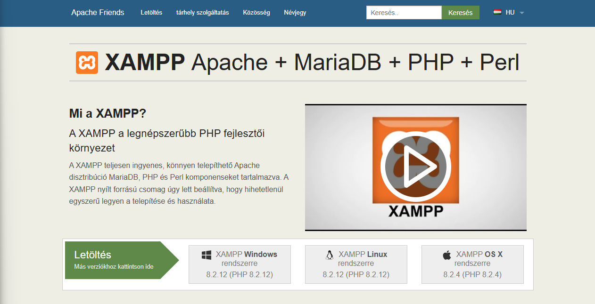
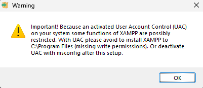
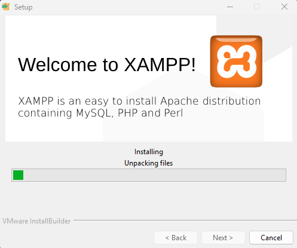
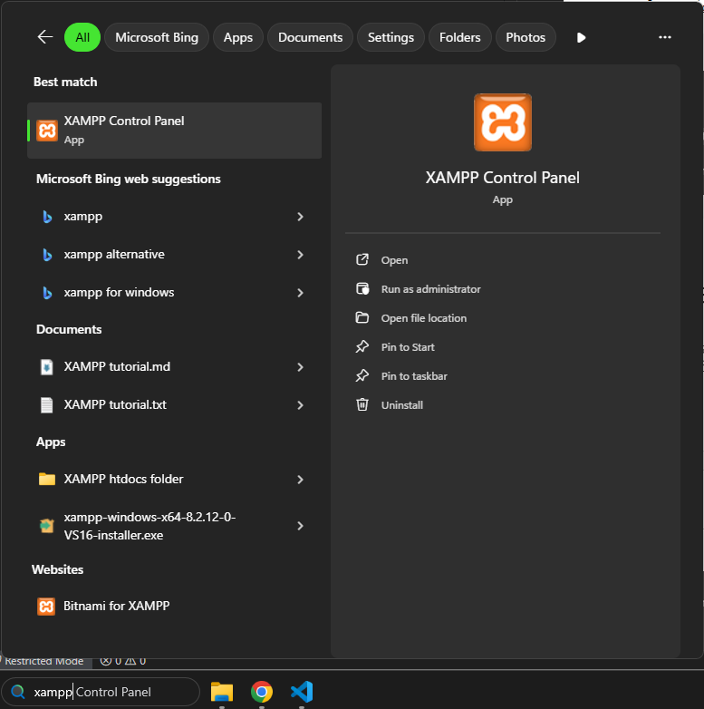
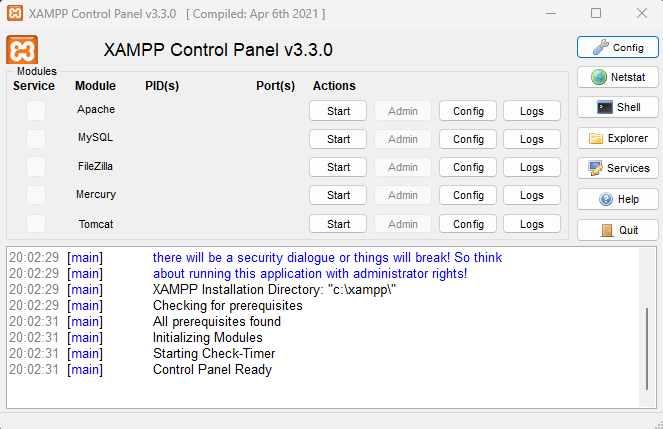
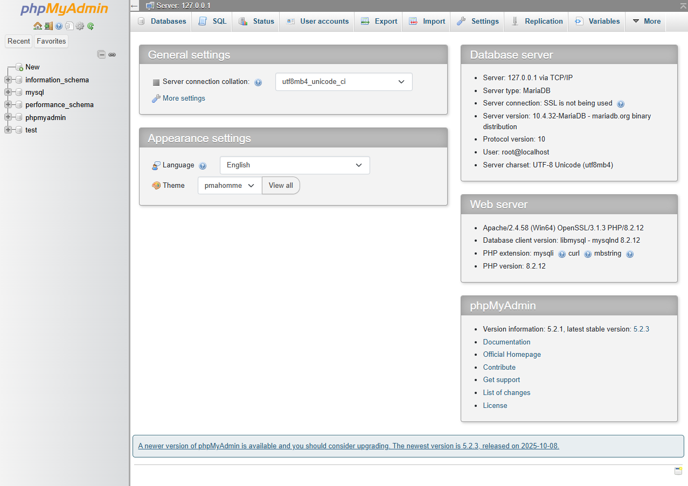
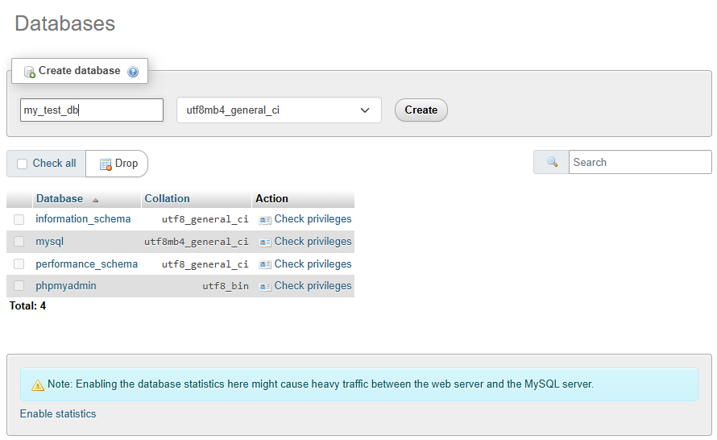
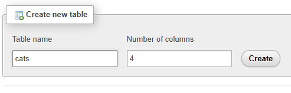
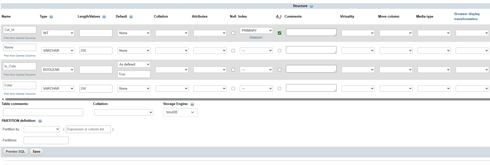
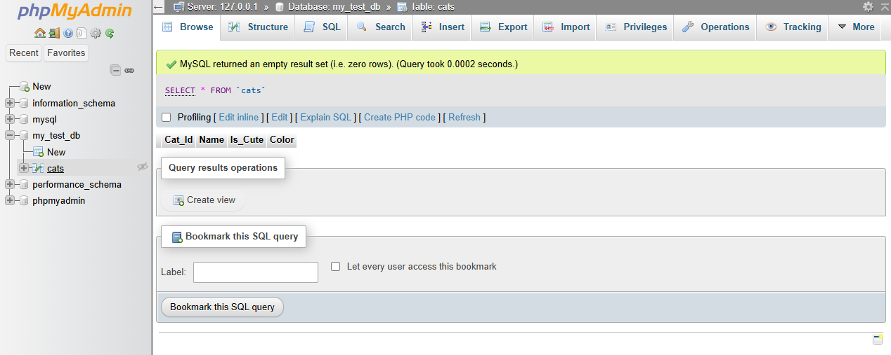

# Installation

Download the installer form this page:

https://www.apachefriends.org

First start you might get warning:

Press `OK`.

Installer starts press
`Next`, `Next`, `Next`, `Next`, `Next`.

This will keep every setting as the default, and start the installation process:

At the end the installation will prompt the `UAC` click `Allow`.

# Starting the application

Search for `XAPMM` on windows search bar and start it:

Application will start:

Click `Start` on `Apache` and `MySQL`. This will start the webserver and the SQL server.

Click on Admin button at MySQL row, this will open the `phpMyAdmin` and in the browser.

# phpMyAdmin

You'll arrive to this page:

Click on `Database` tab and create a new one:

Create a new table:

Set you'r ID as `A_I` it'll make it as Primary key. Setup other columb types and hit Save.

Select the table in your db on the left. You can use the Edit inline option to write queries.

# Interact with C#

Our best bet is to use some NuGet packages to interact with the database.

## `MySql.Data`

Simple approach using direct SQL commands.

See `MySql.Data based solution` region in source.

## `EntityFramework`

More robust ORM based solution.

See `EntityFramework based solution` region in source.